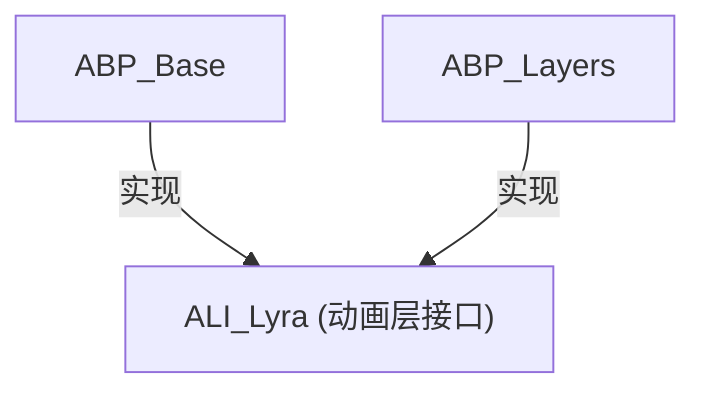
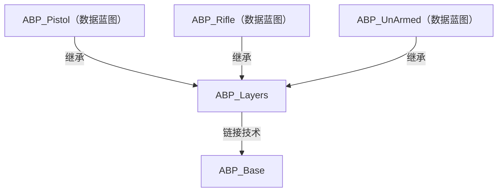

> [动画蓝图](./动画蓝图.md)

## 动画数据结构

> [使用虚幻引擎使用动画蓝图链接 | 虚幻引擎 5.6 文档 | Epic Developer Community](https://dev.epicgames.com/documentation/zh-cn/unreal-engine/using-animation-blueprint-linking-in-unreal-engine)

### 动画蓝图链接系统

使用**动画蓝图链接**系统，可以在动画图表上动态切换子部分，通过 **动画图层接口** 方式获取链接动画蓝图中包含的动画姿势



<code>ABP_Base</code>是主要动画蓝图，设置在角色的Mesh上面。<code>ABP_Base</code>和<code>ABP_Layers</code>均实现了<code>ALI_Lyra</code>接口。可以调用LinkAnimClassLayers来将<code>ABP_Layers</code>对<code>ALI_Lyra</code>的实现链接到<code>ABP_Base</code>中：


### 功能划分

在`ABP_Base`中实现动画状态机，并将状态实现交给`ALI_Lyra`的**动画层接口**来实现：

<div style="display: flex; justify-content: space-between; gap: 5px; margin: 10px 0;">


</div>

`ABP_Layers`派生出`ABP_Pistol`、`ABP_Rifle`和`ABP_UnArmed`分别来将`ABP_Layers`中的动画序列变量赋值为Pistol、Rifle和UnArmed动画。



在`ABP_Base`的BlueprintThreadSafeUpdateAnimation函数中进行数据获取和计算：


### 数据传递

BlueprintThreadSafeUpdateAnimation工作在动画线程而非主线程，因此所有的调用的函数必须勾选线程安全选项，对主线程中的数据访问可以使用[**PropertyAccess**](https://dev.epicgames.com/documentation/zh-cn/unreal-engine/property-access-in-unreal-engine)进行获取：

> [虚幻引擎中的属性访问 | 虚幻引擎 5.6 文档 | Epic Developer Community](https://dev.epicgames.com/documentation/zh-cn/unreal-engine/property-access-in-unreal-engine)


在`ABP_Layers`中使用GetMainAnimInstance可以拿到`ABP_Base`（链接到的蓝图）的引用。为了可以能在PropertyAccess中使用，可以调用封装成纯函数：


## 动画变形

> 需要开启 Animation Warping插件

开启该插件之后可以使用变形函数

### OrientationWraping

可以旋转下部肢体，使动画的方向匹配移动方向


### StrideWarping

可以使动画的脚步匹配移动速度，防止滑步


## 转向时身体倾斜

使用叠加动画的方式将倾斜动画叠加到原有的动画上面，倾斜方向和倾斜角度使用混合动画的方式来控制

倾斜动画只需要一针，需要在附加设置中指定AdditiveAnimType为LocalSpace（或者MeshSpace，按需要），然后BasePoseType设置为SelectedAnimationFrame，BasePoseAnimation设置为倾斜动画的中间动画（即未倾斜的动画），用以计算叠加量


## 距离匹配

> 需要开启AnimationLocomotionLibrary，

### 动画准备

创建曲线压缩设置，修改为UniformIndexable

将需要距离匹配的动画（如移动停止动画）的压缩设置中的曲线压缩设置改为新建的曲线压缩设置

在动画数据修饰符选项卡中选择DistanceCurveModifier为动画添加距离曲线


### 播放动画

要使用距离匹配需要使用SequenceEvaluator节点来驱动动画，它允许指定播放动画的当前帧


使用PredictGroundMovementStopLocation函数节点计算停止距离


将停止距离传入DistanceMatchToTarget节点，以根据当前到停止点的距离以播放正确的停止动画帧


```

```

