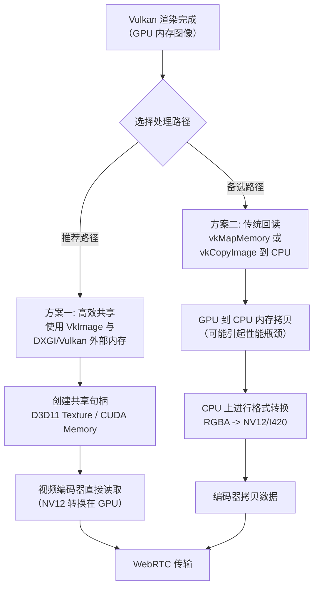

## 目标：

**将本地采集的视频数据，通过WebRTC协议实时传输到服务器或对等端，实现低延迟的直播与通信**

### 核心挑战

1. **数据获取**：如何从 Vulkan 中高效地获取渲染后的帧数据（通常是在 GPU 内存中）。
2. **数据转换**：Vulkan 渲染的数据格式（如 RGBA）通常需要转换为视频编码器（如 H.264）支持的格式（如 NV12/I420）。
3. **零拷贝与高性能**：避免在 GPU 和 CPU 之间进行不必要的内存拷贝，这是降低延迟的关键。
4. **与 WebRTC 集成**：将处理好的视频帧喂给 WebRTC 的传输管道。

---

### 推荐技术思路与架构

整体流程可以概括为：**Vulkan Rendering -> GPU Readback (Optimal) -> (Optional) Conversion -> WebRTC Encoder -> Transmission**。

下图清晰地展示了推荐的两种核心流程，尤其突出了高效的 GPU 内存共享路径：

下面我们对图中的两种方案进行详细阐述。

#### 方案一：最优路径 - 基于 GPU 内存共享（接近零拷贝）

这是性能最高的方法，目标是让视频编码器直接读取 Vulkan 的图像内存，避免 GPU->CPU->GPU 的来回拷贝。

**关键技术点：**

1. **使用外部内存（Vulkan External Memory）**：
    
    - 在创建 Vulkan 的 `VkImage`（存储渲染结果的图像）时，使用 `VkExportMemoryAllocateInfo` 扩展，将其分配在可以被其他 API（如 DirectX、CUDA）访问的内存上。
    - 在 Windows 上，可以导出 `HANDLE`；在 Linux 上，可以导出文件描述符。
2. **在共享内存上创建纹理**：
    
    - **Windows (D3D11)**: 使用导出的 `HANDLE`，通过 `ID3D11Device::OpenSharedResource` 方法在 D3D11 中创建一个共享的 `ID3D11Texture2D`。WebRTC 的 Windows 版本默认使用 D3D11 进行硬件编码，它可以无缝使用这个共享纹理。
    - **Linux (CUDA/V4L2)**: 将导出的内存映射到 CUDA 或 V4L2，供支持 CUDA 或 DRM 的编码器（如 FFmpeg 的 `h264_nvenc`）使用。
3. **格式转换在 GPU 完成**：
    
    - WebRTC 的硬件编码器通常需要 **NV12** 格式。
    - 不要将 RGBA 数据读回 CPU 再转换。应该在 GPU 上使用一个简单的 **计算着色器（Compute Shader）** 或者在 D3D11 中使用 **Video Processor** 将 RGBA 的共享纹理转换为 NV12 的共享纹理。这一步完全在 GPU 上执行，速度极快。
4. **集成到 WebRTC**：
    
    - WebRTC 提供了 `rtc::VideoSourceInterface<webrtc::VideoFrame>` 接口。
    - 你需要自定义一个 `CustomVideoSource` 实现这个接口。
    - 在 `CustomVideoSource` 中，将创建好的 D3D11 NV12 纹理（或者其纹理句柄）封装成 `webrtc::VideoFrame`。
    - 通过 `OnFrame` 回调将帧发送给 WebRTC。

**优点**：延迟极低，CPU 占用率极低，充分利用 GPU 管线。
**缺点**：实现复杂，需要深入理解 Vulkan、D3D11/CUDA 和 WebRTC 内部机制，跨平台兼容性需要额外处理。

---

#### 方案二：备选路径 - 传统回读与编码

如果方案一过于复杂，可以采用更直接但性能稍差的方法。

**关键技术点：**

1. **从 Vulkan 回读图像数据**：
    
    - 渲染完成后，使用 `vkCmdCopyImageToBuffer` 将 `VkImage` 拷贝到一个 `VkBuffer`。
    - 然后使用 `vkMapMemory` 将这个 `VkBuffer` 映射到 CPU 可访问的内存地址。
    - *注意*：这会导致 GPU 与 CPU 的同步（`vkQueueWaitIdle` 或使用 fence），是主要的性能和延迟瓶颈。
2. **在 CPU 上进行格式转换**：
    
    - 映射后得到的是 RGBA 或 BGRA 数据。
    - 使用 **libyuv** 这个高性能的开库，在 CPU 上将 RGBA 转换为 WebRTC 编码器需要的 **I420** 或 **NV12** 格式。
3. **集成到 WebRTC**：
    
    - 同样，自定义一个 `CustomVideoSource`。
    - 将转换后的 I420/NV12 数据封装成 `webrtc::VideoFrame`。这里需要创建一个 `webrtc::I420Buffer` 或 `webrtc::NV12Buffer`，并将 `libyuv` 转换后的数据拷贝进去。
    - 通过 `OnFrame` 回调发送帧。

**优点**：实现相对简单，跨平台兼容性好，代码易于理解和调试。
**缺点**：延迟较高（因为存在 GPU->CPU 的回读等待和数据拷贝），CPU 占用率高（格式转换很耗 CPU）。

---

### 技术栈与库推荐

- **WebRTC 库**：直接使用 Google 提供的 **WebRTC Native C++ API** 进行开发。你需要编译它，这是一个复杂的步骤，但能提供最大的灵活性。
- **格式转换**：
  - **GPU 路径**：Vulkan Compute Shader 或 D3D11 Video Processor。
  - **CPU 路径**：**[libyuv](https://chromium.googlesource.com/libyuv/libyuv/)**（Google 出品，WebRTC 本身就在用它，性能极佳）。
- **编码器**：优先使用 **硬件编码器**。
  - Windows: **H.264/AVC 或 HEVC  via Media Foundation 或 DirectX Video Acceleration (DXVA)**
  - Linux/NVIDIA: **h264_nvenc**
  - Linux/Intel: **VAAPI**
  - macOS: **VideoToolbox**
- **信号信令与网络传输**：WebRTC 原生支持 **SRTP**、**DTLS**、**SCTP**。你需要自己实现或使用一个信令服务器（如 WebSocket）来交换 SDP 和 ICE candidate。

### 实现步骤概要

1. **搭建环境**：编译 WebRTC Native 库，配置好 Vulkan 开发环境。
2. **实现 Vulkan 渲染**：完成你的基础渲染逻辑。
3. **实现帧捕获**：
    - **方案一**：实现外部内存共享、GPU 端格式转换。
    - **方案二**：实现 `vkCmdCopyImageToBuffer` 回读逻辑。
4. **创建自定义视频源**：继承 `rtc::VideoSourceInterface`，在其内部实现从步骤 3 获取帧的逻辑。
5. **创建 WebRTC 对等连接**：
    - 创建 `PeerConnectionFactory` 和 `PeerConnection`。
    - 用你的 `CustomVideoSource` 创建 `VideoTrack`，并添加到 `PeerConnection`。
6. **处理信令**：实现 SDP 和 ICE candidate 的交换，建立 P2P 连接。
7. **测试与优化**：重点关注延迟和性能 profiling，优化瓶颈。

### 总结

对于追求极致低延迟的场景，**强烈推荐方案一（GPU 内存共享）**。虽然实现难度大，但它从架构上消除了最大的性能瓶颈。如果项目周期紧或者资源有限，可以从**方案二（CPU 回读）** 开始实现原型，验证流程，然后再逐步优化到方案一。

这是一个非常高级的集成任务，需要对 Vulkan、图形 API 互操作和 WebRTC 都有较深的理解。祝你成功！

